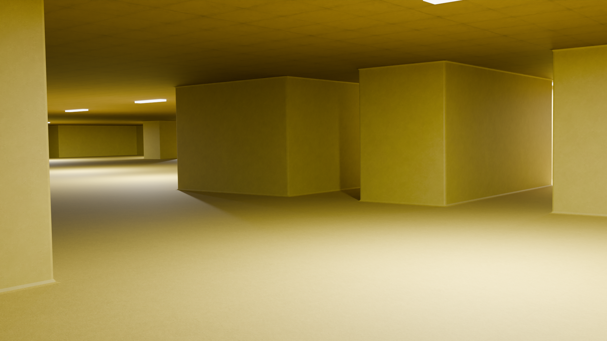
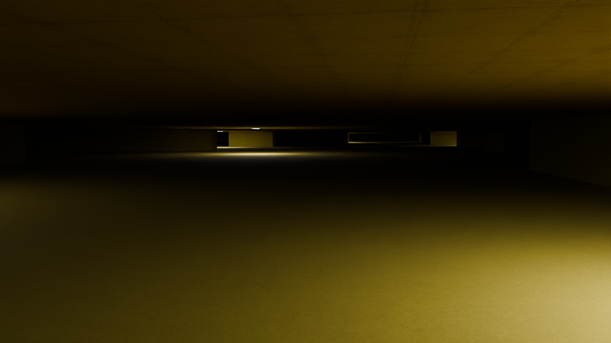
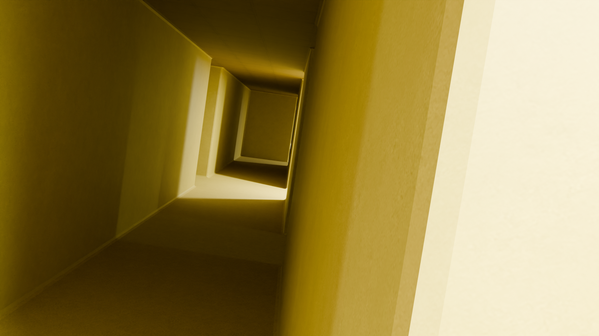
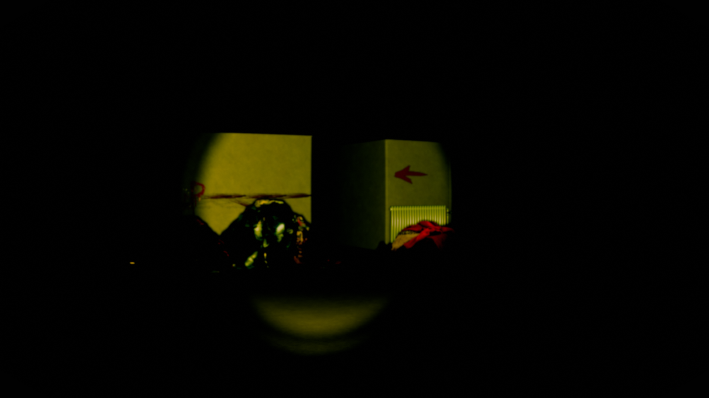

# Blender Backrooms Generator

A procedural Backrooms generator add-on for Blender with configurable layouts, custom textures, aspect-correct UV mapping, ceiling lights, random seeds, and performance-safe light distribution.



---

## Versions

| Version | Description | Download |
|---|---|---|
| **v1.0.0** | Initial Level 0 generator release | [View release](https://github.com/KuzeyKayraEyioglu/blender-backrooms-generator/releases/tag/v1.0.0) |

[View all releases](https://github.com/KuzeyKayraEyioglu/blender-backrooms-generator/releases)

## Features

- Procedural Backrooms layout generation
- Configurable map width, depth, cell size, and wall height
- Adjustable corridor width, straightness, branches, and room frequency
- Random generation or reproducible seed support
- Custom wall, floor, and ceiling textures
- Aspect-correct UV mapping
- Independent texture tiling and roughness settings
- Optional ceiling generation
- Optional bevel modifier for softer wall edges
- Symmetrical, asymmetrical, and random ceiling-light patterns
- Adjustable light spacing, coverage, color, size, and power
- Maximum light limit for improved performance and stability
- Automatic removal of the previously generated map
- Optional automatic Edit Mode entry after generation

## Requirements

- Blender 4.0 or newer

## Installation

1. Download `backrooms_generator_v1_0_0.py`.
2. Open Blender.
3. Go to **Edit > Preferences > Add-ons**.
4. Click the add-on menu and select **Install from Disk**.
5. Select `backrooms_generator_v1_0_0.py`.
6. Enable **Backrooms Generator** from the add-ons list.
7. Open the 3D Viewport and press `N`.
8. Select the **Backrooms** tab in the sidebar.

## Usage

1. Open the **Backrooms** panel in the 3D Viewport sidebar.
2. Configure the map size and layout settings.
3. Optionally select custom wall, floor, and ceiling textures.
4. Configure ceiling-light placement and lighting properties.
5. Click **Generate Backrooms**.
6. Click **Delete Generated** to remove the generated environment.

Generating a new map automatically removes the previously generated Backrooms collection.

## Layout Settings

The generator provides control over:

- Map width and depth
- Cell size
- Wall height
- Open-area density
- Corridor width
- Corridor straightness
- Branch count
- Room chance
- Minimum and maximum room size
- Random seed

Enable **New Result Every Time** to generate a different map on each run.

Disable it and enter a fixed seed to reproduce the same layout.

## Texture System

Custom textures can be assigned separately to:

- Walls
- Floor
- Ceiling

The add-on generates a dedicated `BackroomsUV` map and supports:

- Aspect-ratio preservation
- Horizontal and vertical tiling
- Unlimited tiling input
- Individual roughness values

When no image texture is selected, the generator uses built-in Backrooms-style material colors.

## Ceiling Lights

The generator supports three placement patterns:

- **Symmetrical** — regular and centered placement
- **Asymmetrical** — irregular placement with adjustable offsets
- **Random** — randomized placement

Additional lighting options include:

- Coverage mode
- Light chance
- Light spacing
- Maximum light count
- Fixture dimensions
- Emission strength
- Area-light power
- Area-light size
- Light color
- Light distance below the fixture

Light positions are distributed across the generated map instead of clustering in one area.

The maximum-light setting is always enforced to reduce the risk of excessive memory usage or Blender instability.

## Screenshots

### Generated Layout


### Dark Lighting Example



### Corridor Example



### Custom Scene Example

The environment in this scene was generated with the add-on, while the additional props and scene elements were added manually.



## Performance Notes

Large maps can require additional generation time and memory.

For better performance:

- Use reasonable map dimensions
- Increase light spacing on larger maps
- Keep the maximum-light value limited
- Avoid extremely dense layouts unless necessary
- Disable ceiling lights when they are not needed

Visible light fixtures reuse a shared mesh, and Area Light objects reuse a shared light data block to reduce memory usage.

## Generated Collections

Generated objects are organized inside the following Blender collections:

```text
Backrooms_Generated
├── Geometry
├── Light_Fixtures
└── Area_Lights
